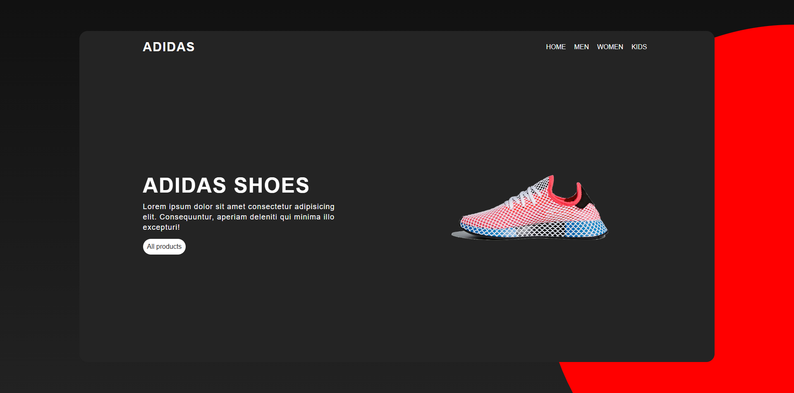

# mohamed-webdev-project-1
Landing Page for Adidas Shoes
# 🎯 Landing Page  

A modern and responsive landing page built with **HTML, CSS**.  

## 🚀 Features  
- Fully responsive design  
- Modern UI with smooth animations  
- Clean and reusable code  

## 🌐 Live Demo  
🔗 [View Demo](https://mohammed-004del.github.io/mohamed-webdev-project-1/)

## 📸 Screenshots  
 

## 🛠️ Technologies  
  
  

## ⚙️ Installation  
1. Clone the repo  
   ```bash
   git clone https://github.com/Mohammed-004del/mohamed-webdev-project-1.git
